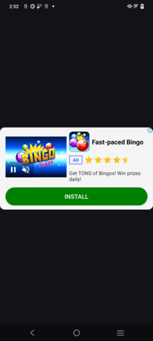
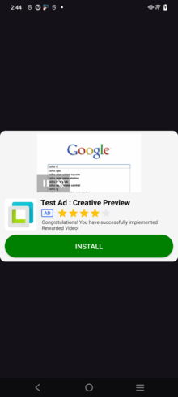
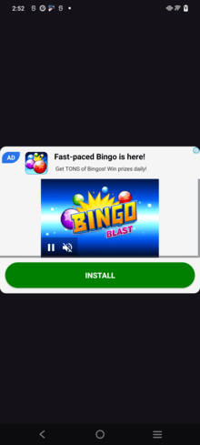

# Admob Ads

🔥 Headline Options:
Plug-and-Play Ad Integration for Android – Native, Banner, Interstitial & More!

Ad Integration Made Easy: One Kotlin Library for All Ad Formats

Boost Your App Revenue – Seamless Ads with Customizable Layouts

## All-in-One Ad Library for Android with Templates & Easy Controls

## Simplify Monetization – Native, Banner, Interstitial, and App Open Ads in Minutes

## This Kotlin library empowers Android developers to:

Load Native, Banner, Interstitial & App Open Ads

Use built-in loading layouts and templates

Customize UI components directly

Reduce setup time and boost ad revenue instantly

Users are time-sensitive and may skip an app due to long loading times and missing visual feedback. 

This library implements the Skeleton View pattern and provides an easy way for other developers to enable it in their apps. 

### Getting Started

##### Gradle
```gradle
buildscript {
    repositories {
        mavenCentral()
    }
}
```
```gradle
dependencies {
    implementation 'com.github.Technest-PK:Google-Admob-Ads:1.1-alpha'
}
```

##### XML
```xml
        <FrameLayout
            android:id="@+id/nativeAd"
            android:layout_width="match_parent"
            android:layout_height="wrap_content"
            app:layout_constraintBottom_toBottomOf="parent"
            app:layout_constraintEnd_toEndOf="parent"
            app:layout_constraintStart_toStartOf="parent"
            app:layout_constraintTop_toTopOf="parent" />
```

##### Kotlin
```kotlin
class MainActivity : AppCompatActivity() {

    private lateinit var skeleton: Skeleton

    override fun onCreate(savedInstanceState: Bundle?) {
        super.onCreate(savedInstanceState)
        setContentView(R.layout.activity_main)

        AdmobNativeAd(
            this,
            binding.nativeAd,
            "/21775744923/example/native-video",
            "large",
            "#008000"
        )
            .load()
    }


}
```

##### Java
```java
public class MainActivity extends AppCompatActivity {
    
    private FrameLayout nativeAd;
    
    @Override
    public void onCreate(@Nullable Bundle savedInstanceState) {
        super.onCreate(savedInstanceState);
        setContentView(R.layout.activity_main);
        nativeAd = findViewbyid(R.id.nativeAd);
        
       AdmobNativeAd(
            this,
            nativeAd,
            "/21775744923/example/native-video",
            "large",
            "#008000"
        )
            .load();
    }
    

}
```

## Say goodbye to complex ad integrations!
This Kotlin-powered Android library lets you load all major ad types—Native, Banner, Interstitial, App Open—with beautiful templates, smooth loading layouts, and user-controlled UI. Monetization has never been this simple.


### Configuration

| Property                | Type      | Description                                                                                                               |
|-------------------------|-----------|---------------------------------------------------------------------------------------------------------------------------|
| nativesize              | size      | Must for Native size ("banner" , "small/adaptive" , "medium" , "large" , "large_1")   |
| background color        | color     | Color of the Native Ad container (defaults to ##008000)                                                                   |

## Native Ad Template Design

## Banner Native 


## Small Native / Adaptive Native


## Medium Native


## Large Native


## Large Native 1


### Third-party licenses

This software uses following technologies with great appreciation:

* [AndroidX](https://developer.android.com/jetpack/androidx)
* [ColorSlider](https://github.com/naz013/ColorSlider)
* [gradle-maven-publish-plugin](https://github.com/vanniktech/gradle-maven-publish-plugin)
* [Material Components for Android](https://material.io/components)

### License

Copyright 2025 Philipp Fahlteich

Licensed under the Apache License, Version 2.0 (the "License");
you may not use this file except in compliance with the License.
You may obtain a copy of the License at

    http://www.apache.org/licenses/LICENSE-2.0

Unless required by applicable law or agreed to in writing, software
distributed under the License is distributed on an "AS IS" BASIS,
WITHOUT WARRANTIES OR CONDITIONS OF ANY KIND, either express or implied.
See the License for the specific language governing permissions and
limitations under the License.

 
