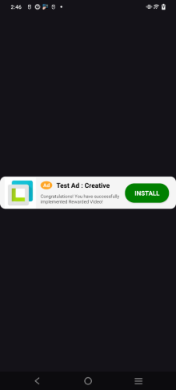
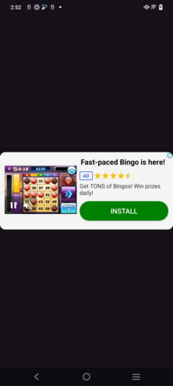
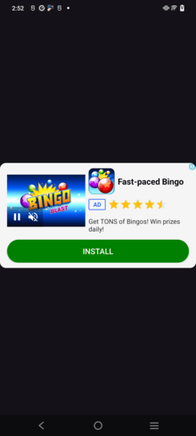
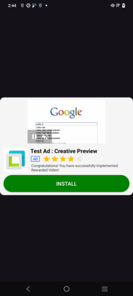
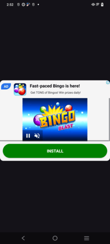

# Google AdMob Ads

An Android library for loading **Native**, **Banner**, **Interstitial**, and **App Open** ads with built-in templates, skeleton loaders, and a single host-app callback for impression-level revenue.

[](https://jitpack.io/#t-libraries/Google-Admob-Ads)
[](http://www.apache.org/licenses/LICENSE-2.0)
[](https://developer.android.com/google/play/requirements/target-sdk)
[](https://developers.google.com/admob/android/quick-start)

## Features

- Native ads with multiple templates (small / adaptive, medium, large, large_1)
- Banner ads: standard, large, medium rectangle, collapsible (top / bottom)
- Splash and in-app interstitial ads (click counter or timer)
- Interstitial preloading via AdMob Preloader (`loading_type = "api"`)
- App Open ads on process foreground, with activity exclusions
- Skeleton loading layouts while ads load
- Premium / IAP flag that hides and skips all ads
- Jetpack Compose or XML loading dialogs
- Impression-level paid events forwarded to the host app (Firebase Analytics or any other tracker)

## Requirements

| Item | Value |
|---|---|
| minSdk | 23 |
| Language | Kotlin / Java |
| Google Mobile Ads | `play-services-ads` 25.4.0 |
| Distribution | [JitPack](https://jitpack.io/#t-libraries/Google-Admob-Ads) |

---

## 1. Installation

### Gradle (Groovy)

```gradle
dependencyResolutionManagement {
    repositories {
        google()
        mavenCentral()
        maven { url 'https://jitpack.io' }
    }
}
```

```gradle
dependencies {
    implementation 'com.github.t-libraries:Google-Admob-Ads:Tag'
}
```

### Gradle (Kotlin DSL)

```kotlin
dependencyResolutionManagement {
    repositories {
        google()
        mavenCentral()
        maven(url = "https://jitpack.io")
    }
}
```

```kotlin
dependencies {
    implementation("com.github.t-libraries:Google-Admob-Ads:Tag")
}
```

Replace `Tag` with the latest [release / JitPack tag](https://jitpack.io/#t-libraries/Google-Admob-Ads).

---

## 2. App setup

### Manifest

Add your AdMob App ID. Use a Google test ID while developing.

```xml
<manifest xmlns:android="http://schemas.android.com/apk/res/android">

    <uses-permission android:name="android.permission.INTERNET" />

    <application
        android:name=".MyApplication"
        ...>

        <meta-data
            android:name="com.google.android.gms.ads.APPLICATION_ID"
            android:value="@string/appid" />

    </application>
</manifest>
```

```xml
<!-- res/values/strings.xml or build.gradle resValue -->
<string name="appid">ca-app-pub-3940256099942544~3347511713</string>
```

### Application class

Initialize interstitial config and (optionally) the revenue listener once:

```kotlin
class MyApplication : Application() {

    companion object {
        var myApplication: MyApplication? = null
    }

    override fun onCreate() {
        super.onCreate()
        myApplication = this

        AdmobInterstitialAd.getInstance().initInterFromConfig(
            this,
            InterAdModel(
                inter_type = "timer",          // "timer" or "click"
                loading_type = "manual",       // "manual" or "api" (preloader)
                inter_counter_start = 1,
                inter_counter_gap = 1,
                inter_start_after_seconds = 15,
                inter_start_load_before_seconds = 5,
                inter_gap_after_seconds = 30,
                inter_gap_load_before_seconds = 25
            ),
            "ca-app-pub-3940256099942544/1033173712"
        )

        AdmobAdManger.setAdRevenueListener(1.30) { eventName, params ->
            FirebaseAnalytics.getInstance(this).logEvent(eventName, params)
        }
    }
}
```

Register `MyApplication` in the manifest with `android:name=".MyApplication"`.

---

## 3. Native and Banner ads

Use `AdmobAdManger` with a `MaterialCardView` container and an inner `FrameLayout`.

### XML

```xml
<com.google.android.material.card.MaterialCardView
    android:id="@+id/adContainer"
    android:layout_width="wrap_content"
    android:layout_height="wrap_content"
    app:cardBackgroundColor="#f1f0f8"
    app:cardCornerRadius="@dimen/_8sdp"
    app:strokeWidth="0dp">

    <FrameLayout
        android:id="@+id/adLayout"
        android:layout_width="wrap_content"
        android:layout_height="wrap_content" />

</com.google.android.material.card.MaterialCardView>
```

### Kotlin

```kotlin
val item = RemoteModel(
    id = "ca-app-pub-3940256099942544/1044960115",
    ad_format = "native",   // "banner" or "native"
    ad_type = 1,
    hide = false,
    cta_color = "#F42727"
)

AdmobAdManger(this, binding.adContainer, binding.adLayout)
    .setBannerCollapsiblePosition(BannerPosition.BOTTOM) // optional, default BOTTOM
    .setMargintoNative(14, 14)                           // optional, default 0, 0
    .setSkeltonColor("#C8C8C8".toColorInt())             // optional
    .setCtaPostion("bottom")                             // "top" or "bottom"
    .setTextColor(
        headingtextColor = "#000000".toColorInt(),
        bodytextColor = "#4E4E4E".toColorInt()
    )
    .loadAd(
        item,
        DefaultAdPlacement.BANNER // used when model is null or id is empty
    )
```

### Java

```java
RemoteModel item = new RemoteModel(
        "ca-app-pub-3940256099942544/1044960115",
        "native",
        1,
        false,
        "#F42727"
);

new AdmobAdManger(this, adContainer, adLayout)
        .setBannerCollapsiblePosition(BannerPosition.BOTTOM)
        .setMargintoNative(14, 14)
        .setSkeltonColor(Color.parseColor("#C8C8C8"))
        .setCtaPostion("bottom")
        .setTextColor(Color.parseColor("#000000"), Color.parseColor("#4E4E4E"))
        .loadAd(item, DefaultAdPlacement.BANNER);
```

If `RemoteModel` is `null`, `hide = true`, or `id` is empty, the manager either hides the container or falls back to `DefaultAdPlacement`.

### `RemoteModel`

| Field | Type | Description |
|---|---|---|
| `id` | `String` | Ad unit ID. Empty string uses `DefaultAdPlacement`. |
| `ad_format` | `String` | `"banner"` loads a banner. Any other value loads a native ad. |
| `ad_type` | `Int` | Layout / size. See tables below. |
| `hide` | `Boolean` | `true` hides the ad container. |
| `cta_color` | `String` | Native CTA button color, e.g. `"#F42727"`. |

This model is Gson-annotated, so it can be parsed from Remote Config JSON.

### Native `ad_type`

| `ad_type` | Template |
|---|---|
| `1` | Large Native 1 |
| `2` | Large Native |
| `3` | Small / Adaptive Native (default) |
| `4` | Medium Native |

CTA placement is controlled with `setCtaPostion("top")` or `setCtaPostion("bottom")`.

### Banner `ad_type`

| `ad_type` | Size |
|---|---|
| `1` | Collapsible adaptive banner |
| `2` | Standard adaptive banner (default) |
| `3` | Medium rectangle |
| `4` | Large banner |

Collapsible banners use `setBannerCollapsiblePosition(BannerPosition.TOP)` or `BannerPosition.BOTTOM`.

### Native templates

<p align="center">
  
  
</p>

<p align="center">
  
  
  
</p>

---

## 4. Interstitial ads

All interstitial APIs go through the singleton:

```kotlin
AdmobInterstitialAd.getInstance()
```

### Config (`InterAdModel`)

Call `initInterFromConfig()` from `Application.onCreate()`.

| Field | Values | Description |
|---|---|---|
| `inter_type` | `"click"` / `"timer"` | Show by click counter or by elapsed time. |
| `loading_type` | `"manual"` / `"api"` | `"manual"` loads on demand. `"api"` uses AdMob Interstitial Preloader. |
| `inter_counter_start` | `Int` | Clicks before the first in-app interstitial. |
| `inter_counter_gap` | `Int` | Clicks between later interstitials. |
| `inter_start_after_seconds` | `Long` | Seconds after app start before the first timer interstitial. |
| `inter_start_load_before_seconds` | `Long` | Load the first timer ad this many seconds before it is eligible to show. |
| `inter_gap_after_seconds` | `Long` | Seconds between later timer interstitials. |
| `inter_gap_load_before_seconds` | `Long` | Load the next timer ad this many seconds before it is eligible to show. |

If both start and gap counters / times are `0`, in-app interstitials are disabled.

### Click-based (manual)

```kotlin
AdmobInterstitialAd.getInstance().initInterFromConfig(
    this,
    InterAdModel(
        inter_type = "click",
        loading_type = "manual",
        inter_counter_start = 2,
        inter_counter_gap = 3
    ),
    getString(R.string.inside_interstitial)
)
```

### Timer-based (manual)

```kotlin
AdmobInterstitialAd.getInstance().initInterFromConfig(
    this,
    InterAdModel(
        inter_type = "timer",
        loading_type = "manual",
        inter_start_after_seconds = 15,
        inter_start_load_before_seconds = 5,
        inter_gap_after_seconds = 30,
        inter_gap_load_before_seconds = 25
    ),
    getString(R.string.inside_interstitial)
)
```

### Preload (`loading_type = "api"`)

Uses `InterstitialAdPreloader` with a buffer of 2 ads. Show still goes through `showInterAd()`; the manager routes to `AdmobPreloadInterstitialAd` automatically.

```kotlin
AdmobInterstitialAd.getInstance().initInterFromConfig(
    this,
    InterAdModel(
        inter_type = "click",   // or "timer"
        loading_type = "api",
        inter_counter_start = 1,
        inter_counter_gap = 1
    ),
    getString(R.string.inside_interstitial)
)
```

### Splash interstitial

Load during splash, show when the splash flow finishes.

```kotlin
AdmobInterstitialAd.getInstance().loadSplashInter(
    this,
    getString(R.string.splash_interstitial),
    onAdLoaded = {
        // ad ready
    },
    onAdFailedToLoad = {
        // continue without ad
    }
)
```

```kotlin
AdmobInterstitialAd.getInstance().showSplashInterAd(
    this,
    message = { status -> /* optional status text */ },
    callBack = { shown ->
        startActivity(Intent(this, HomeActivity::class.java))
        finish()
    }
)
```

From a Fragment:

```kotlin
AdmobInterstitialAd.getInstance().showSplashInterAd(
    requireActivity(),
    callBack = { /* continue */ }
)
```

If the splash ad is still in memory when the in-app interstitial is requested, it is reused as the first inside ad.

### In-app interstitial

```kotlin
AdmobInterstitialAd.getInstance().showInterAd(
    this,
    message = { status -> },
    callBack = {
        // always called (ad dismissed, failed, skipped, or premium)
        startActivity(Intent(this, NextActivity::class.java))
    }
)
```

`callBack` is invoked whether the ad showed or not, so navigation should live there.

---

## 5. App Open ads

Create once (typically from `Application` or the first activity). The library observes `ProcessLifecycleOwner` and shows an ad when the app returns to the foreground. Cold start does **not** show an app-open ad.

```kotlin
MyApplication.myApplication?.let { application ->
    AdmobAppOpenAd(
        applicationContext = application,
        ad_Id = "ca-app-pub-3940256099942544/9257395921",
        exceptionalActivities = listOf("MainActivity")
    )
}
```

App Open is skipped automatically when:

- the user is premium (`AdmobAdManger.isPurchased(true)`)
- an interstitial is showing
- the current activity name contains `splash`, `iap`, `AdActivity`, `premium`, or `subscription`
- the activity simple name is listed in `exceptionalActivities`

---

## 6. Impression revenue (Firebase)

The ads module does **not** depend on Firebase. Every ad format attaches `OnPaidEventListener` and forwards a bundle to the host app.

Register **once** in `Application.onCreate()`:

```kotlin
AdmobAdManger.setAdRevenueListener(1.30) { eventName, params ->
    FirebaseAnalytics.getInstance(this).logEvent(eventName, params)
}
```

Add Analytics in the **application** module:

```gradle
implementation("com.google.firebase:firebase-analytics")
```

| Argument | Description |
|---|---|
| `revenueMultiplier` | Applied to AdMob `valueMicros` before logging. Example: `1.30`. |
| `eventName` | `"ad_impression_adj"` |
| `params` | Analytics `Bundle` (see below) |

`params` keys:

| Key | Content |
|---|---|
| `value` | Adjusted revenue |
| `currency` | ISO currency from AdMob |
| `ad_platform` | `"Custom"` |
| `ad_source` | `"Custom"` |
| `ad_unit_name` | Ad unit ID |
| `ad_format` | `app_open`, `banner`, `interstitial`, or `native` |
| `PriceAccuracy` | `"BID"` |
| `revenue_precision` | AdMob precision type |

Paid events are attached on:

- App Open (`onAdLoaded`)
- Banner (`AdView` creation)
- Interstitial splash + inside (`onAdLoaded`)
- Preload interstitial (after `pollAd()`)
- Native (when the ad is bound)

---

## 7. Global controls

```kotlin
// Hide / skip every ad for premium users
AdmobAdManger.isPurchased(true)

// Use Compose loading overlay instead of XML
AdmobAdManger.isComposed(true)

// Loading dialog colors (interstitial + app open)
AdmobInterstitialAd.getInstance().setLoadingDialogTextColor(Color.BLACK)
AdmobInterstitialAd.getInstance().setLoadingDialogBgColor("#FFFFFF".toColorInt())
```

Call `isPurchased()` whenever the IAP / subscription state changes.

---

## 8. End-to-end example

```kotlin
class MyApplication : Application() {
    companion object {
        var myApplication: MyApplication? = null
    }

    override fun onCreate() {
        super.onCreate()
        myApplication = this

        AdmobInterstitialAd.getInstance().initInterFromConfig(
            this,
            InterAdModel(
                inter_type = "click",
                loading_type = "manual",
                inter_counter_start = 2,
                inter_counter_gap = 3
            ),
            "ca-app-pub-3940256099942544/1033173712"
        )

        AdmobAdManger.setAdRevenueListener(1.20) { eventName, params ->
            FirebaseAnalytics.getInstance(this).logEvent(eventName, params)
        }
    }
}

class MainActivity : AppCompatActivity() {

    override fun onCreate(savedInstanceState: Bundle?) {
        super.onCreate(savedInstanceState)
        setContentView(binding.root)

        MobileAds.initialize(this)
        AdmobAdManger.isPurchased(false)

        MyApplication.myApplication?.let {
            AdmobAppOpenAd(it, "ca-app-pub-3940256099942544/9257395921")
        }

        AdmobInterstitialAd.getInstance().loadSplashInter(
            this,
            "ca-app-pub-3940256099942544/1033173712",
            onAdLoaded = {},
            onAdFailedToLoad = {}
        )

        AdmobAdManger(this, binding.adContainer, binding.adLayout)
            .setTextColor("#000000".toColorInt(), "#4E4E4E".toColorInt())
            .loadAd(
                RemoteModel(
                    id = "ca-app-pub-3940256099942544/9214589741",
                    ad_format = "banner",
                    ad_type = 2,
                    hide = false,
                    cta_color = "#FFC0CB"
                ),
                DefaultAdPlacement.BANNER
            )
    }
}
```

---

## 9. Test ad units

Use Google's sample IDs while developing:

| Format | Sample ad unit |
|---|---|
| App ID | `ca-app-pub-3940256099942544~3347511713` |
| App Open | `ca-app-pub-3940256099942544/9257395921` |
| Banner | `ca-app-pub-3940256099942544/9214589741` |
| Interstitial | `ca-app-pub-3940256099942544/1033173712` |
| Native | `ca-app-pub-3940256099942544/2247696110` |

Replace them with your own units before release.

---

## License

Copyright 2025 [t-libraries](https://github.com/t-libraries)

Licensed under the Apache License, Version 2.0:

```
http://www.apache.org/licenses/LICENSE-2.0
```
